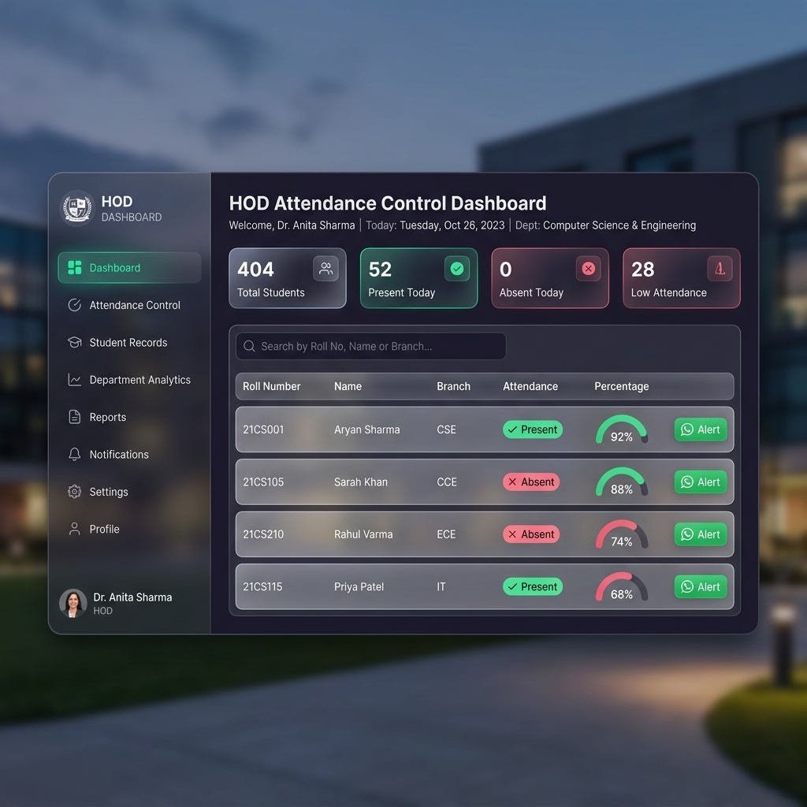
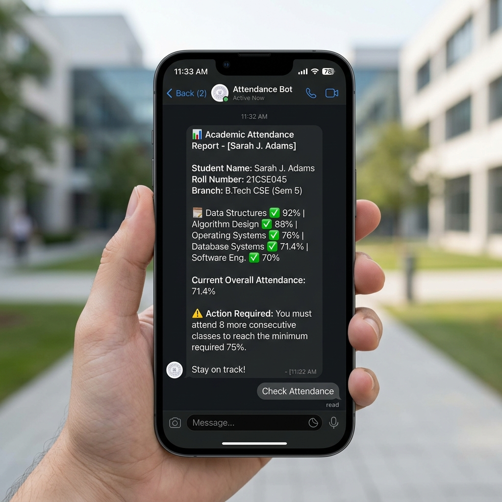
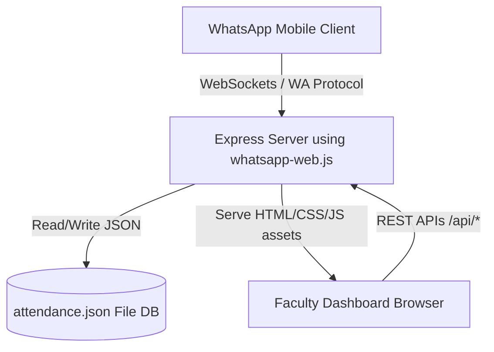

# Aditya University Attendance Bot & Control Dashboard

[](https://render.com/deploy?repo=https://github.com/manikanta3137/aditya-attendance-bot-)

🚀 **Local Web Portal Link:** [http://localhost:3000](http://localhost:3000)


A production-grade, full-stack attendance management system featuring a **Direct WhatsApp Chatbot** (powered by `whatsapp-web.js` running on your own WhatsApp account) and a secure **Faculty/HOD Administration Dashboard**.

It is pre-populated with **150 student profiles** (1,500 active attendance records) from the Aditya University Excel dataset, persisted locally inside a lightweight JSON database.

---

## 📸 Reference Screens & Interaction Mockups

### 1. HOD Administration & CRUD Dashboard
Modern, glassmorphic dark-theme console enabling Faculty and HODs to view student percentages, edit individual class statistics, manage phone configurations, and trigger live WhatsApp warnings.


### 2. WhatsApp Mobile Chatbot Flow
The dialogue flow on a student's mobile device querying their attendance profile by choosing a branch and entering their Roll Number.


---

## 🚀 Key Features

- **Direct WhatsApp Connection**: Uses the WhatsApp Web protocol (`whatsapp-web.js`). Requires **no Twilio developer account**, no custom sandbox rules, and no port-forwarding tunnels (e.g. ngrok).
- **Interactive QR Code Setup**: Non-technical users can link their WhatsApp account directly from the browser dashboard by clicking the connection status dot and scanning the generated QR code.
- **Dynamic Warning Advice**: Automatically calculates attendance metrics:
  - If overall attendance is **below 75%**, it calculates the exact number of consecutive classes the student must attend: $\text{Classes to Attend} = \max(0, 3T - 4A)$.
  - If overall attendance is **at or above 75%**, it calculates how many consecutive classes they can safely skip: $\text{Classes to Skip} = \max(0, \lfloor \frac{4A}{3} - T \rfloor)$.
- **Secure HOD Dashboard**: JWT-protected authentication (`faculty`/`faculty123` or `admin`/`admin123`) with full CRUD control.
- **Dataset Import/Export**: Upload custom CSVs to overwrite and seed the JSON file database, or download the current records with a single click.

---

## 🏗️ System Architecture



---

## 📁 Project Structure

| File/Directory | Description |
| :--- | :--- |
| `server.js` | Express app host, routes, JWT security, and WhatsApp client event handling |
| `db.js` | File-persisted database manager writing to `attendance.json` |
| `attendance.json` | Active local database storing the 150 student attendance records |
| `init-db.js` | Seeding script that populates `attendance.json` from the original Excel sheet |
| `public/` | Direct static assets served by the web app (dashboard layout, styles, and front-end scripts) |
| `Dockerfile` | Multi-stage build script configured to install Alpine Chromium dependencies |
| `render.yaml` | Service blueprint for automatic 24/7 cloud deployments |

---

## 🛠️ Local Installation & Configuration

### Prerequisites
*   [Node.js](https://nodejs.org/) (v18 or higher)
*   Google Chrome installed locally (to run the browser automation)

### Setup Steps
1. **Clone & Install Dependencies**:
   ```bash
   npm install
   ```
2. **Seed the JSON Database**:
   ```bash
   npm run init-db
   ```
3. **Start the Express Server**:
   ```bash
   npm start
   ```
4. **Open the Dashboard**:
   Open **[http://localhost:3000](http://localhost:3000)** in your browser.

---

## 📲 Linking Your WhatsApp Account

1. Open the dashboard at **[http://localhost:3000](http://localhost:3000)**.
2. In the top-right header, click the red **`🔴 Setup Bot`** badge.
3. Open WhatsApp on your phone (`9398881606`) -> **Linked Devices** -> **Link a Device**.
4. Scan the QR code shown in the popup window.
5. The status badge will automatically turn green (**`🟢 WhatsApp Linked`**), and the chatbot will be live!

---

## ☁️ Cloud Deployment (Render 24/7)

This project contains a pre-configured `Dockerfile` and `render.yaml` blueprint to run on **Render** with a persistent disk:

1. Push this project to your GitHub account.
2. In the **Render Dashboard**, click **New +** > **Blueprint** and link your repository.
3. Render will read `render.yaml`, spin up the Alpine container, install Chromium, and mount a **1GB persistent disk** at `/usr/src/app/data` to save your `attendance.json` database changes across container rebuilds.
4. Access the server logs tab on Render to scan the QR code and link your phone!
